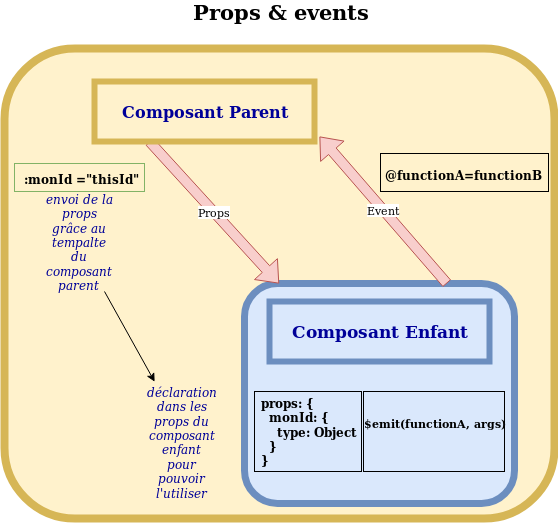

# VUE.JS


## Mettre en place un projet vue.js

2 méthodes : création manuelle ou avec le Vue-CLI

### Création manuelle

Ajouter vue.js dans le ___html___ : ``` <script src="https://cdn.jsdelivr.net/npm/vue/dist/vue.js"></script>``` 
```html
<script src="https://cdn.jsdelivr.net/npm/vue/dist/vue.js"></script> <!--ajout de vue -->

<div id="app">

<h1> Titre</h1>
<p>

Ici je peux utiliser Vue.js !</p>
</div>
```


Initialiser vue.js grâce à la variable ___vue___ dans le ___fichier  js___ : 

``` javascript
 new Vue({
    el: '#elementHtml' //l'id utilisé est celui de la div html ciblée pour utiliser du vue

 })
 ```

 ### Avec le Vue-CLI

 Se positionner dans le dossier voulu et lancer la commande 
``npm install -g @vue/cli``
Il peut être utile de nettoyer le cache si d'autres projets s'y trouvent
``sudo npm cache clean --force``

Pour lancer l'interface de création du projet dans le navigateur
``vue ui``

## __Organisation d'un projet__

__App.vue__ : fichier principal qui englobe tous les composants de l’application. On y retrouve trois sections :  `<template> `, `<script>` et `<style>` qui permettent respectivement de mettre du code HTML (le template), le code JavaScript (les données, les méthodes, les événements…) et le code CSS

__index.html__ est quand à lui le point d’entrée de l’application. Il comporte uniquement le boilerplate html de base ainsi qu’une div avec l’id App qui nous servira de point de départ du code de l’application

__main.js__ qui est le fichier “racine” de l’application. C’est lui qui va faire le lien entre la vue et le modèle dans notre cas (Vue.js utilise le MVVM).


Les dépendances Webpack :  elles sont installées de manière totalement transparente grâce au client vue. Elles nous permettent de séparer la définition même d’un composant dans un fichier javascript dédié ce qui nous permet d’avoir notre style, template et js dans un même fichier

### Segmenter une vue / un composant

Initialement le fichier .vue peut accueillir le style et le javascript. La bonne pratique préconise de créer un dossier dédié et d'y placer le code séparé de la manière suivante : 
- .vue
- .js
- .css
- .md
- .spec.ts
...

Il sera important de déplacer le code de style et de js dans les fichiers idoines, tout en indiquant un lien au fichier .vue :

```js
<script src="./home.js"></script>

<style scoped lang="scss" src="./home.scss"></style>
```

## Utiliser un component 


## Afficher des variables 


Les variables sont utilisées à l'intérieur de l'objet ___data___ qui va contenir toutes les propriétés. 

``` js

 new Vue({
    el: '#elementHtml' ,
    data: {
        title: 'Titre de ma page'
}
 })
```

 On utilise {{ ... }} pour afficher les propriétés dans le ___html___: 

 ```html
<script src="https://cdn.jsdelivr.net/npm/vue/dist/vue.js"></script> <!--ajout de vue -->

<div id="app">

<h1> {{ title }}</h1>
<p>

Ici je peux utiliser Vue.js !</p>
</div>
```

## Gérer des méthodes

Les méthodes sont déclarées dans une nouvelle propriété du composant ___Vue___ , appelée ___methods___ .
Ici on ajoute un bouton qui appelera au clic la méthode reversTitle. 
L'instruction ``v-on`` sert à écouter les évènements du DOM afin d'éxécuter du JavaScript.

```html
<div id="app">
<h1>{{ title }}</h1>
<button v-on:click="reverseTitle">Inverser</button>
</div>
```


```js
new Vue({
el: '#app',
data: {
title: 'Vue is easy'
},
methods: {
reverseTitle: function() {
this.title = this.title.split('').reverse().join('');
}
}
})
```

## Créer de nouvelles pages avec le router


Le routeur est la partie qui synchronise la vue actuellement affichée avec le contenu de la barre d'adresse du navigateur.

### Dans le fichier router.js

```js
export default new Router({
  mode: "history",
  base: process.env.BASE_URL,
  routes: [
    {
      path: "/",
      name: "home",
      component: Home
          // redirect: { name: "children" }, --- SI ENFANT ! ---
      // children: [
      //   {
      //     path: "children",
      //     name: "home",
      //     component: Home
      //   }
      // ]
    },
    {
      ...
    }
  ]
})
```

### Dans le fichier main.js

## Les propriétés de composants

### Props et Events

Les props permettent à un composant parent d'envoyer des données ou des méthodes à un composant enfant. 




__Attention : Elles ne peuvent être modifiées que par le composant parent, elles ne peuvent pas être modifiées
dans le composant enfant__

### Data 

 Le data est une fonction qui retourne un objet qui contient des valeurs


Les events permettent la même chose d'un composant enfant vers un composant parent

## Le Store VueX

##  LIfecycle d'un composant

Created > Mounted > Updated > Destroyed

Computed : liste de méthodes calculées une seule et unique fois lorsque le composant est dans le hook (état) Created

Mounted : fonction appelée lorsque le composant est monté


### Tester l'existence d'une variable

```js
testExist () {
      if (this.myVar === !this.myVar) { // en écrivant !this.myVar on teste le undefined et le null de celle_ci
        return 'Non ma variable n\'existe pas'
      } else {
        return 'Ma variable existe'
      }
```

## Les Helpers en javascript

Ces fichiers servent à mettre à disposition du projet des méthodes de calcul ou de manipulation (de mécaniques en somme)

## Prototype

IL sagit de l'élément en dessous un élément (object ou tableau) comparable à une classe qui permet d'avoir accès des méthodes natives (entre autres)
relatives au type de l'élément

 
# VueX

Vuex est un gestionnaire d'état (« state management pattern ») et une bibliothèque pour des applications Vue.js. 
Il sert de zone de stockage de données centralisée pour tous les composants dans une application, avec des règles pour s'assurer que l'état ne puisse subir de mutations que d'une manière prévisible. Il s'intègre également avec l'extension officielle de Vue afin de fournir des fonctionnalités avancées comme de la visualisation d'état dans le temps et des exports et imports d’instantanés (« snapshot ») d'état.

## State

Vuex utilise un arbre d'état unique, c'est-à-dire que cet unique objet contient tout l'état au niveau applicatif et sert de « source de vérité unique ». Cela signifie également que vous n'aurez qu'un seul store pour chaque application. Un arbre d'état unique rend rapide la localisation d'une partie spécifique de l'état et permet de facilement prendre des instantanés de l'état actuel de l'application à des fins de débogage.

## Mutations

